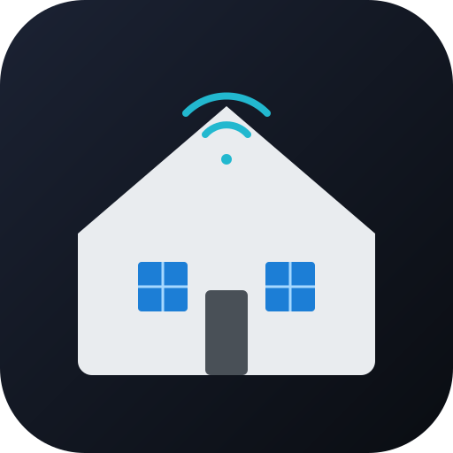

> 🇬🇧 English | [🇩🇪 Deutsch](README.de.md)

<p align="center">
  
</p>

# Home Connect for Homematic IP

Bring your Bosch, Siemens, Gaggenau, NEFF, Thermador or Constructa appliances
into Homematic IP. Without a cloud bridge, without a Raspberry Pi.

📦 **[Download the latest plugin](https://github.com/fabiorenner-hub/hmip-hcu-homeconnect/releases/latest)** — install via *HCUweb → Developer mode → Plugins → Install from file*.

[](LICENSE)
[](https://github.com/homematicip/connect-api)

---

## What it does

After three minutes of setup your appliances appear as Homematic IP devices.
You can switch power, monitor remaining cycle time, start the selected
program, see the door state and read estimated energy use — all directly in
the Homematic IP app, in scenes, in groups and in automations.

| Feature                    | What you get                                 |
| -------------------------- | -------------------------------------------- |
| ⚡ Power                    | `SWITCH` — turn the appliance on or off      |
| 💡 Cavity light            | `LIGHT` — control hood, oven or fridge light |
| 🌡️ Cooling temperature     | `CLIMATE_SENSOR` — fridge / freezer setpoint |
| ▶️ Program control          | `SWITCH` — start / abort selected program    |
| 🔌 Estimated energy        | `ENERGY_METER` — `currentPower` and `kWh`    |

The plugin uses the live Home Connect event stream, so state changes show up
in seconds — no polling required.

## Setup in 3 steps

### Step 1 — Get a Client ID

1. Open [developer.home-connect.com/applications](https://developer.home-connect.com/applications)
   and sign in. If you don't have an account yet, click *Register*
   (it's free and takes about 1 minute).
2. Once you're in the dashboard, click **Register Application** in the top right.
3. Fill in the form **exactly** like this:

   | Field | Value | Notes |
   | ----- | ----- | ----- |
   | Application ID | anything, e.g. `HCU Plugin` | Visible only to you |
   | OAuth Flow | **`Device Flow`** | ⚠️ **This is the most common mistake — must be Device Flow, not Authorization Code Grant Flow.** |
   | Home Connect User Account for Testing | your own Home Connect e-mail | The same account that owns the appliances |
   | Success Redirect | *(empty)* | Not used by Device Flow |
   | One Time Token Mode | *Disabled* | |
   | Proof Key for Code Exchange | *Disabled* | |

4. Click **Save**.
5. On the application details page, copy the **Client ID** — a string of
   64 hex characters (uppercase). You **don't** need the Client Secret.

### Step 2 — Install the plugin

1. Download the latest `hmip-hcu-homeconnect-<version>.tar.gz` from the
   [Releases page](https://github.com/fabiorenner-hub/hmip-hcu-homeconnect/releases).
2. In HCUweb, enable *Developer mode*, open the *Plugins* page, click
   *Install from file* and upload the tarball.
3. After a few seconds the plugin appears in the list.

### Step 3 — Sign in

1. Open the plugin's configuration page in HCUweb.
2. Paste the **Client ID** and click *Save*.
3. The page shows a **login link** and a **QR code** in the *Login* section.
   The link points directly to `api.home-connect.com` and works from any
   browser — your laptop, your phone, anything with internet.
4. Open the link (or scan the QR code with your phone), sign in with the
   Home Connect account configured in your developer application and
   click *Allow*.
5. Reload the plugin configuration page once. The status switches to
   `✓ Connected to Home Connect.` and your appliances appear in the
   Homematic IP app.

That's it. The plugin remembers your login across HCU restarts.

### How to start over

If you ever need to log in again (for example after rotating the Client ID),
open the plugin configuration page, enable **Restart login** and save. A
fresh login link appears.

### Advanced: setup wizard on port 8124

The plugin also exposes a richer setup wizard on `http://<container-IP>:8124/`.
On a stock HCU this port is **not** reachable from the LAN (the plugin runs
inside a container sandbox, only the HCU itself can reach the port). It is
included for advanced setups where you've exposed the port to the LAN
manually.

## Configuration reference

Everything except the Client ID has a sensible default.

| Section | Setting | Default | Notes |
| ------- | ------- | ------- | ----- |
| Login | Client ID | *(empty)* | 64 hex chars from Home Connect Developer Portal |
| Login | Restart login | off | Enable + save to discard the stored login and start a fresh device flow |
| Devices | On/off switch | on | Power per appliance |
| Devices | Cavity / ambient light | on | Hood, oven, fridge inner light |
| Devices | Cooling temperature | on | Fridge / freezer setpoint |
| Devices | Program control | on | Start the selected program (ON), abort (OFF) |
| Devices | Energy meter | on | Estimated `currentPower` + accumulated `kWh` |
| Advanced | Language | `de-DE` | Language for program names |
| Advanced | Polling interval | 0 (off) | In addition to the live event stream |
| Advanced | Diagnostic dashboard | off | Web UI on `http://<HCU-IP>:8123/` |
| Advanced | Verbose logging | off | Logs every API and HCU frame |

## Diagnostic dashboard (optional)

Enable *Diagnostic dashboard* in *Advanced*. The plugin then serves a small
web UI at `http://<HCU-IP>:8123/` with seven tabs:

- **Overview** — readiness, HCU connection, Home Connect token state
- **Devices** — every appliance with live settings and status
- **API** — raw `GET/PUT/POST/DELETE` console for the Home Connect REST API
- **Events** — live SSE stream
- **Energy** — sparkline charts and the kWh counters
- **Logs** — filterable log stream
- **Config** — current configuration, JSON-formatted

Don't expose this dashboard outside your trusted network — it does no auth.

## Updates (over-the-air)

Under *Advanced* you can pick an **update channel** and **mode**:

- **stable** (default) — vetted GitHub releases.
- **experimental** — rolling prereleases, delivered over-the-air without a new
  `.tar.gz`/HCUweb upload. For testers.
- **mode** `manual` (default) checks in the background and lets you install on
  demand; `auto` installs new versions on the selected channel automatically.

The plugin boots through a small bootstrap loader that runs either the baked-in
image or an installed OTA payload, with crash-loop protection: if an OTA payload
fails to start three times it is quarantined and the plugin rolls back to the
image automatically. A stable core image always wins over an older OTA payload.
Major upgrades that need a newer core still ship as a `.tar.gz` via HCUweb.

## Anonymous usage statistics

To understand how many installs exist and which versions/firmware are in the
field, the plugin sends **anonymous usage statistics**. This is **on by
default** and can be **turned off** any time via *Advanced → Send anonymous
usage statistics* (opt-out).

It transmits only pseudonymous technical metadata: schema version, event
(`start` / `heartbeat` / `update`), an anonymous install id, plugin id,
plugin/core/OTA version, build id, CPU architecture, HCU firmware and the
2-letter language. The install id is a SHA-256 hash (64 hex chars) — the HCU
serial/SGTIN is **never** transmitted.

It never sends names, serial numbers, IP addresses, e-mail, location, rooms,
device names/addresses, measurements, automations, schedules, configuration or
tokens. The exact payload is viewable via the `analyticsPreview` action on the
debug dashboard. Sending is fire-and-forget with short timeouts and never blocks
the plugin. Turn the switch off to disable.

## Troubleshooting

| Symptom | Likely cause | Fix |
| ------- | ------------ | --- |
| `unauthorized_client: client not authorized for this oauth flow` | The application in the Home Connect portal is set to *Authorization Code Grant Flow*. | In the developer portal, change the OAuth flow of the application to **Device Flow**. |
| `unauthorized_client: client has limited user list - user not assigned to client` | You're trying to log in with a different account than the one configured in the application. | In the developer portal under *Home Connect User Account for testing*, set the e-mail of the account you sign in with. |
| `Configuration applied` but the appliances never appear | Login link still pending. | Open the login link from the plugin configuration page or its QR code, sign in, then reload the configuration page. |
| Plugin keeps reporting `Konfiguration ausstehend` | Client ID is wrong (must be exactly 64 hex chars). | Re-copy the Client ID from the Home Connect portal. |

For deeper analysis enable *Verbose logging* and check the plugin logs in
HCUweb — every HTTP exchange with Home Connect is logged with status code,
`x-request-id` and OAuth `error` / `error_description`.

## Building from source

```powershell
# Windows
./build.ps1
```

```bash
# macOS / Linux
chmod +x build.sh
./build.sh
```

The build script reads the version from `package.json`, builds a
`linux/arm64` Docker image with the Connect API metadata label, runs
`docker save`, gzips the result into `dist/hmip-hcu-homeconnect-<version>.tar.gz`
and mirrors it into the repo root.

Run the test suite with `npm test` (smoke + dashboard E2E).

## Support this project

If this plugin saves you time, consider [a small donation via PayPal](https://www.paypal.com/donate/?hosted_button_id=JPZRATUUHRT5C).
It keeps the lights on while I build more HCU plugins.

## Credits and license

Built against the [Homematic IP Connect API 1.0.1](https://github.com/homematicip/connect-api)
by eQ-3. Uses the official [Home Connect Developer API](https://developer.home-connect.com/)
under OAuth2 Device Flow. Mapping inspired by [`ioBroker.homeconnect`](https://github.com/bowm0815/ioBroker.homeconnect) (MIT).

Apache-2.0. *Home Connect* is a trademark of BSH Hausgeräte GmbH;
*Homematic IP* is a trademark of eQ-3 AG. Brand names (Bosch, Siemens,
Gaggenau, NEFF, Thermador, Constructa) belong to their respective owners.
This project is not affiliated with or endorsed by either company.

Issued by **Fabio Renner**.
